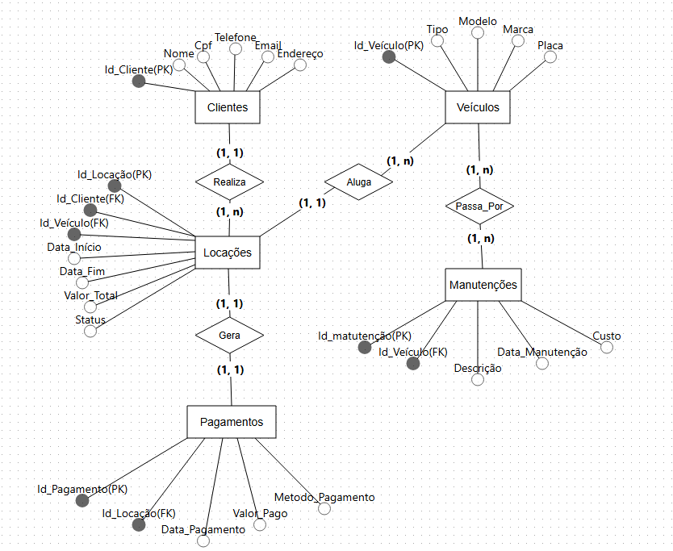

# 🚗 Projeto de Banco de Dados — Locadora de Veículos

Este projeto simula um sistema de gerenciamento para uma locadora de carros. Ele inclui a criação de tabelas, inserção de dados, operações de atualização e exclusão, além de consultas SQL utilizando recursos como joins, agrupamentos e filtros.
---

## 📌 Objetivos

- Modelar um banco de dados relacional com base em um cenário real
- Utilizar comandos DDL e DML do PostgreSQL
- Aplicar boas práticas de modelagem (chaves primárias, estrangeiras, restrições, etc.)
- Executar consultas SQL com diferentes cláusulas
---

## 📂 Estrutura do Projeto

O projeto está dividido nas seguintes etapas:

- Modelagem Conceitual (Modelo conceitual)
- Modelagem Lógica (Modelo relacional)
- Criação do banco de dados (CREATE)
- Inserção de dados (INSERT)
- Manipulação de dados (UPDATE e DELETE)
- Consultas SQL com diferentes níveis de complexidade
- Documento explicativo (este README)
---

## 📌 Funcionalidades Modeladas

- Cadastro de clientes com CPF e e-mail únicos
- Registro de veículos com controle de disponibilidade
- Locações com datas, status e vínculo a cliente e veículo
- Controle de pagamentos por locação
- Histórico de manutenções dos veículos
- Restrições de integridade (PK, FK, CHECK, UNIQUE, DEFAULT)
---

## 🔗 Estrutura de Modelagem

### 📘 Modelagem Conceitual

### 📘 Modelagem Lógica

